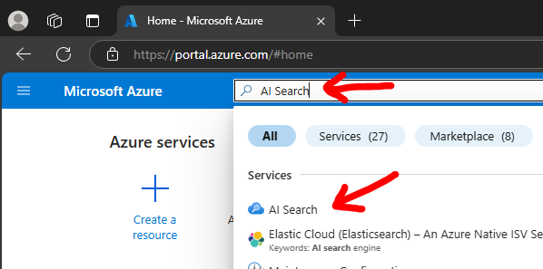
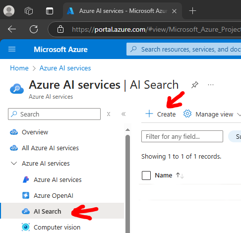
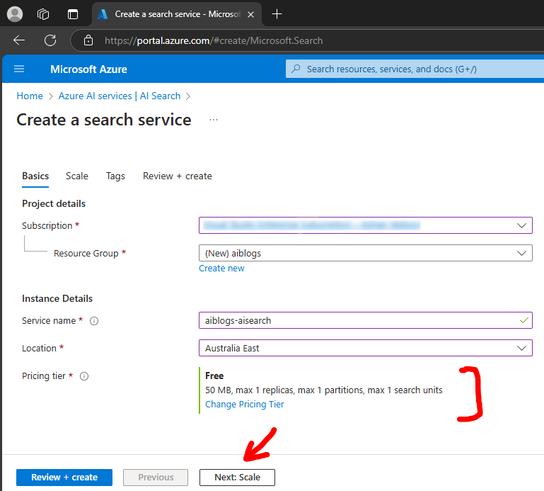
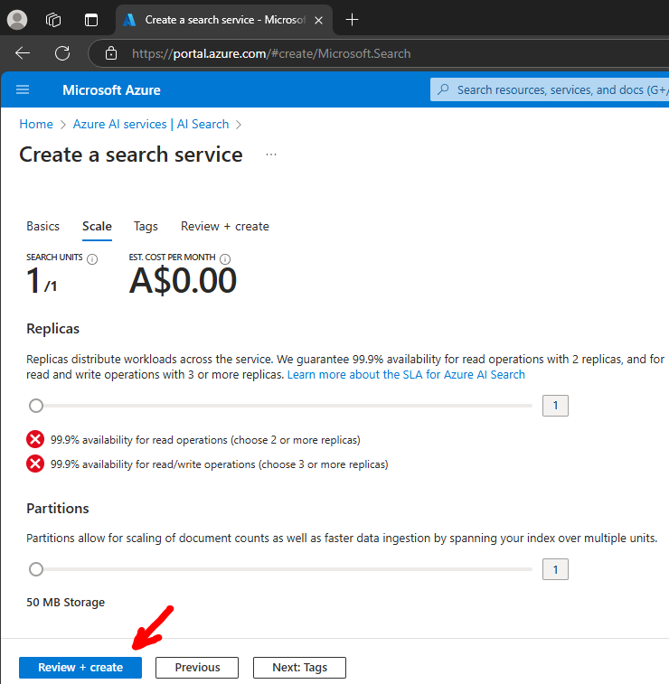
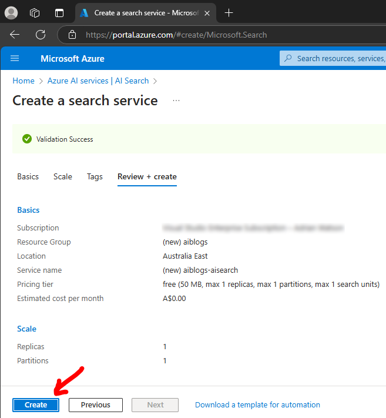
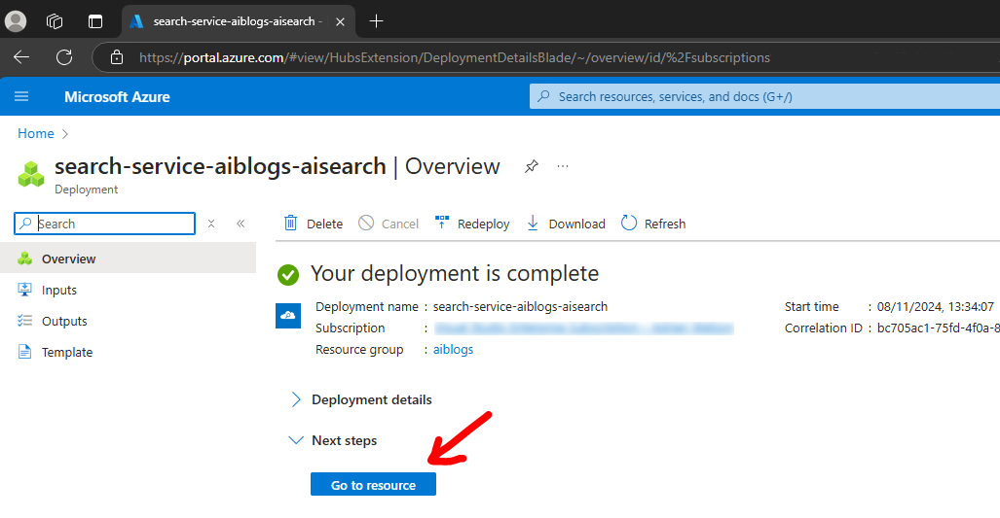
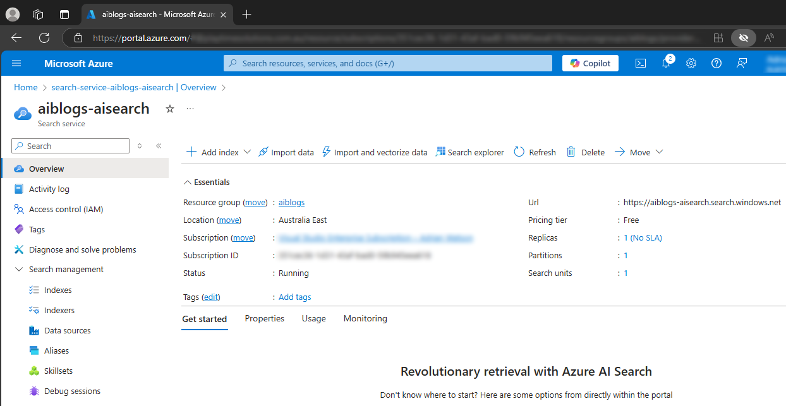
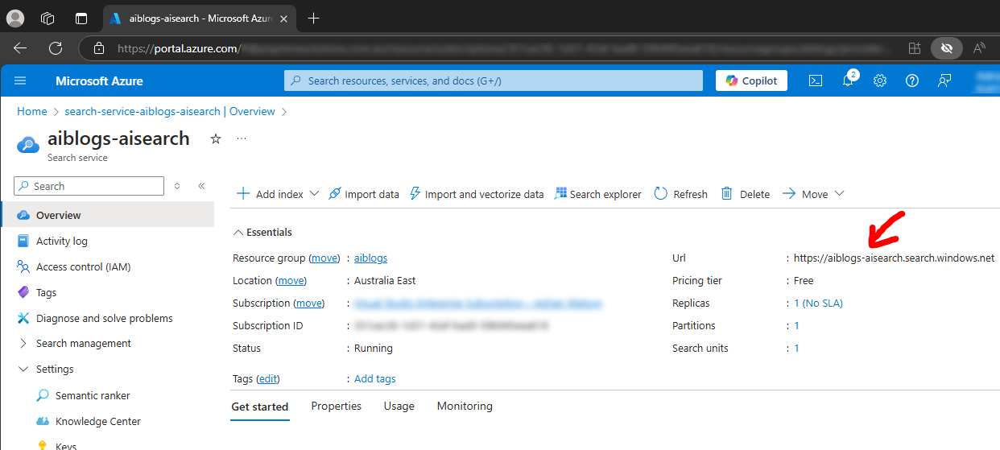
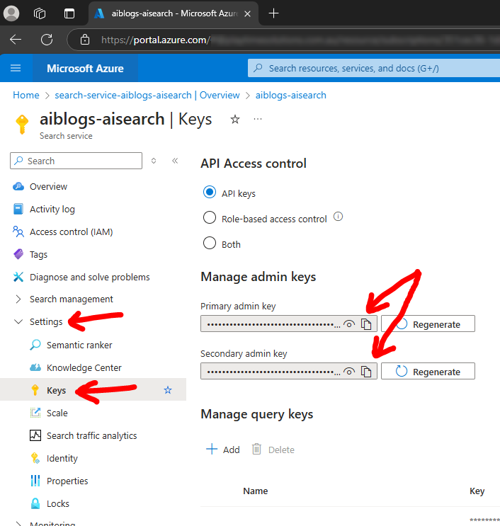

# Intelligent Applications - Create Azure AI Search service

This document details how to create the Azure AI Search service within the Azure portal for use with your applications.

## Pre-requisites

You must have a valid Azure subscription and relevant role permissions to create Azure AI Search resources.

## Useful links

* [Main Azure AI Search documentation web site](https://learn.microsoft.com/en-us/azure/search)
* [Vectorize text and images by using the Azure portal](https://learn.microsoft.com/en-us/azure/search/search-get-started-portal-import-vectors)
* [Manually index Blog storage](https://learn.microsoft.com/en-us/azure/search/search-semi-structured-data)

## Steps

1. Go to the Azure portal, https://portal.azure.com

1. Search for `AI Search` and select it 

1. Click `+ Create` 

1. Enter the basics details and click `Next: Scale` 
Pay particular notice to the `Pricing tier`! 

1. Enter the scale details and click `Review + create` 

1. Review the details are correct and click `Create` 

1. Wait for deployment to complete then click `Go to resource` 

1. View your new Azure AI Search service 

## Example projects configuration

In order to use your Azure AI Search service in the example code you will various properties from the service.

1. Service URL endpoint 
This will be used in the `appsettings` configuration for `AzureAISearch.Endpoint`. 
Go to your Azure AI Search service overview blade.
Copy the `Url` to the clipboard which you can use in the sample code. 

1. Primary or secondary `Manage admin key` 
This will be used in the `appsettings` configuration for `AzureAISearch.ApiKey`. 
Go to your Azure AI Search service and select the `Settings` / `Keys` blade.
View and copy either of the admin keys to the clipboard which you can use in the sample code. 

