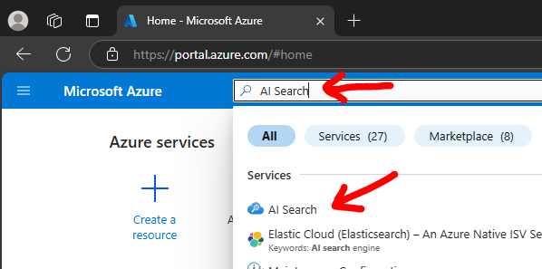
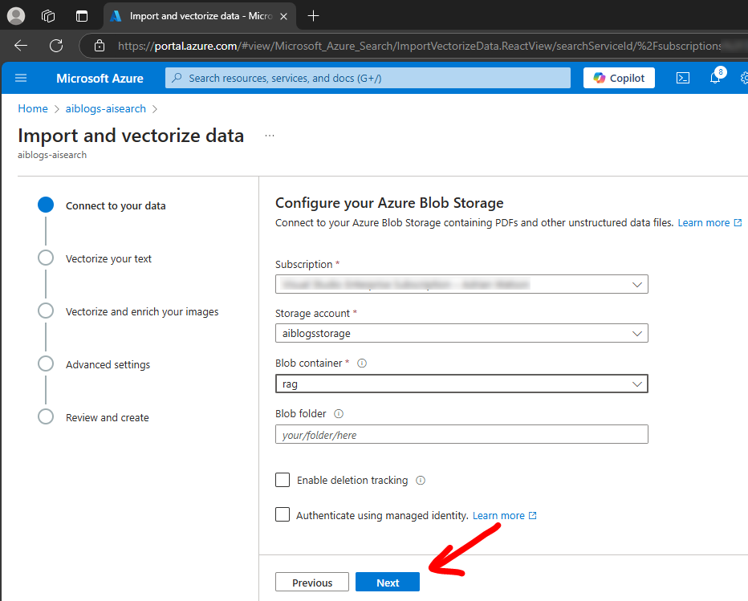

# Intelligent Applications - Index Blob storage

This document details how to use the  Azure AI Search service to index a Blob storage container for use with RAG calls within applications.

## Multiple ways to import and vectorize

There is a simple mostly automated way to import driven mostly just selecting what to import plus there is a more complex manual way where you import a data source.

The complex way involves connecting to the data source then defining the index fields and usage. Unless you are a competant Azure AI Search user then its easier to use the automated approach.
For the sake of this example repository, we will use the simple approach.

## Pre-requisites

1. You must have an Azure AI Search service deployed - [see here](../create-azureaisearch-service/README.md)

1. An Azure OpenAI service must exist - [see here](../../azure-openai/create-azureopenai-service/README.md)

1. An Azure OpenAI service embeddings model must be deployed in order to vectorize the data - [see here](../../azure-openai/create-openai-deployment/README.md)

1. An Azure Blog storage account is required with a container which contains files to index 
For my example I create the storage account called `aiblogsstorage` and a container called `rag`.

## Steps to import the simple way

1. Go to the Azure portal, https://portal.azure.com

1. Search for `AI Search` and select it 

1. Select your new Azure AI Search service 

1. On the `Overview` blade, click `Import and vectorize data` 

1. Click `Azure Blob Storage` 

1. Enter the Blob container details and click `Next` 

1. Select the embeddings model to vectorize the data, acknowledge the connection and click `Next` 

1. Amend vectorization details and click `Next` 

1. Set a vectorization schedule and click `Next` 

1. Prefix the index objects names and click `Next` 

1. Wait for the indexing to complete, click `Start searching` 

1. Validate your index has some data, click `Search` 

