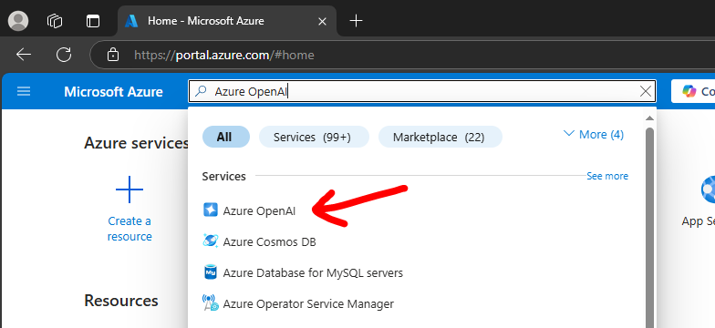
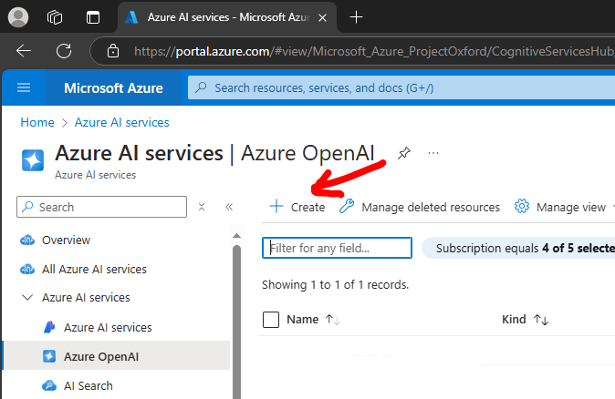
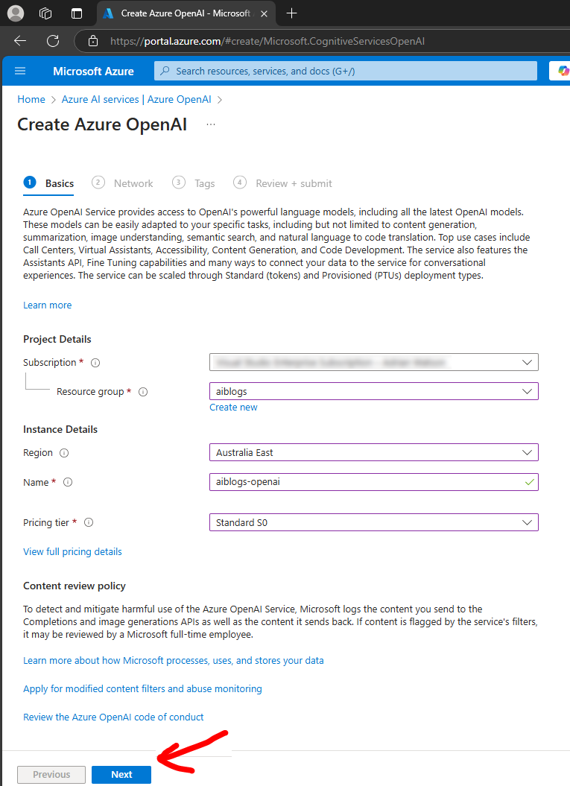
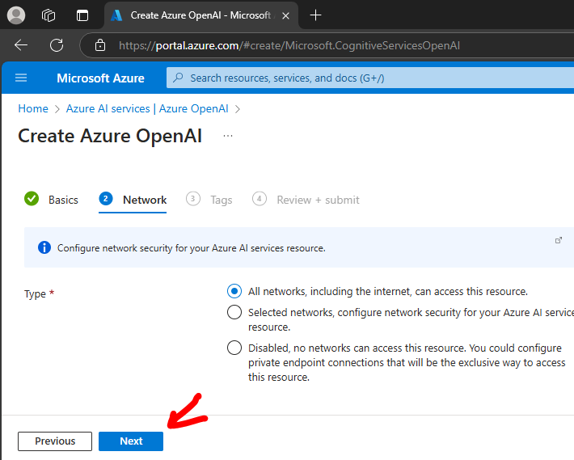
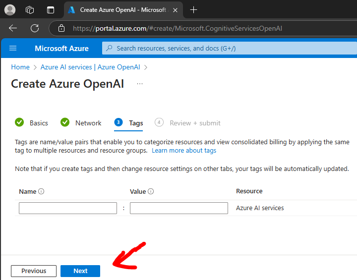
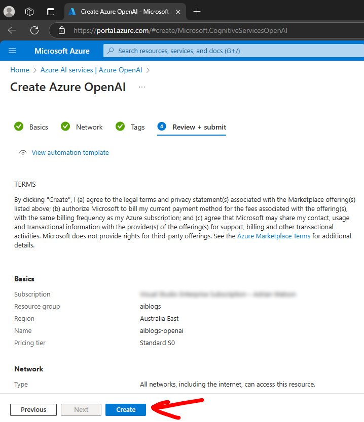
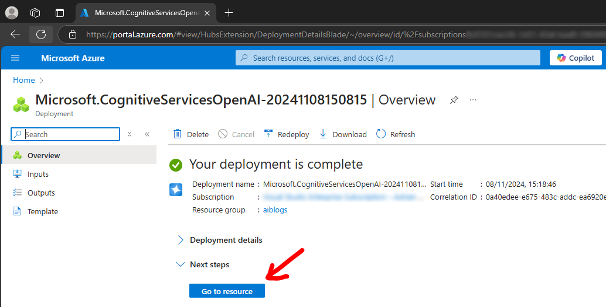
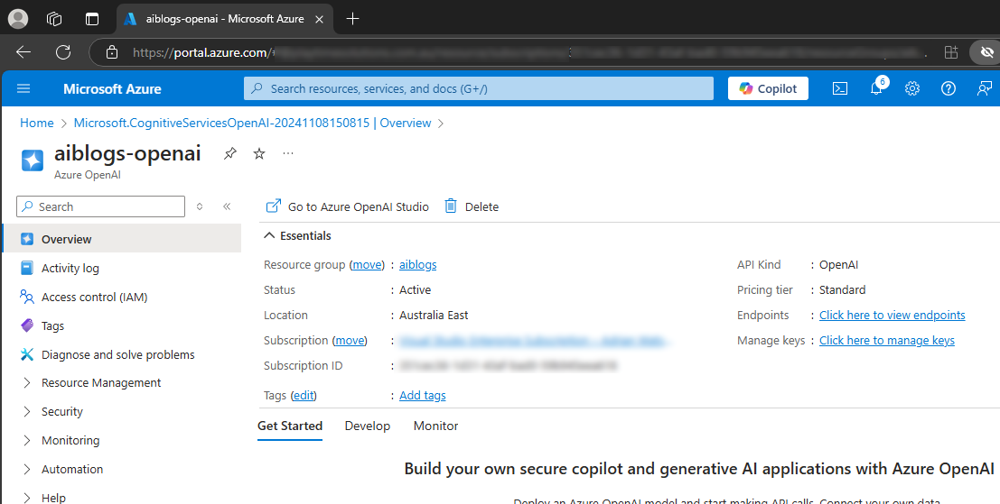
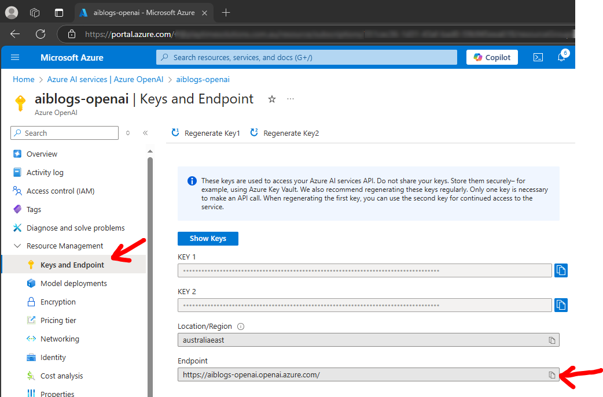
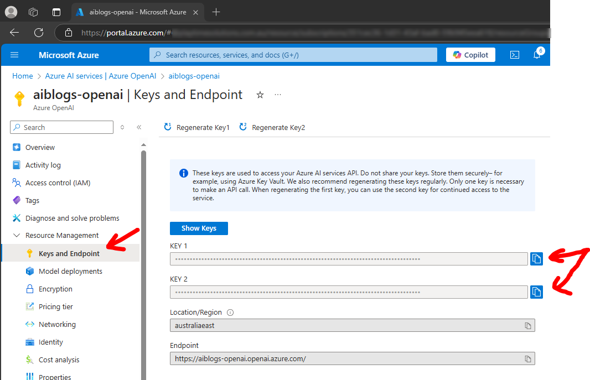

# Intelligent Applications - Create Azure OpenAI service

This document details how to create the Azure OpenAI service within the Azure portal for use with your applications.

## Pre-requisites

You must have a valid Azure subscription and relevant role permissions to create Azure OpenAI resources.

## Steps

1. Go to the Azure portal, https://portal.azure.com

1. Search for `Azure OpenAI` and select it 

1. Click `+ Create` to create a new service instance 

1. Enter the basic details and click `Next` 

1. Enter the network details and click `Next` 

1. Enter the tags details and click `Next` 

1. Review the details are correct and click `Create` 

1. Wait for deployment to complete then click `Go to resource` 

1. View your new Azure OpenAI service 

## Example projects configuration

In order to use your Azure OpenAI service in the example code you will various properties from the service.

1. Service URL endpoint 
This will be used in the `appsettings` configuration for `Endpoint`. 
Go to your Azure OpenAI service and select the `Resource Management` / `Keys and Endpoint` blade.
Copy the `Endpoint` to the clipboard which you can use in the sample code. 

1. Access `KEY` 
This will be used in the `appsettings` configuration for `ApiKey`. 
Go to your Azure OpenAI service and select the `Resource Management` / `Keys and Endpoint` blade.
View and copy either of the `KEY 1` or `KEY 2` to the clipboard which you can use in the sample code. 

