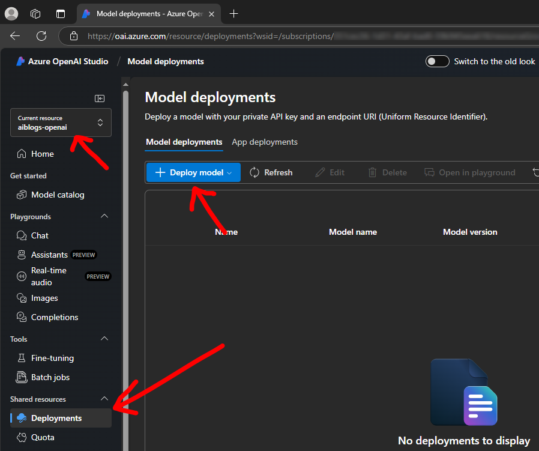
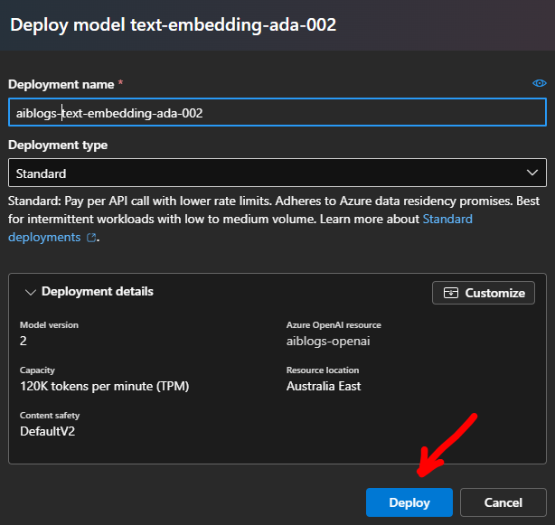

# Intelligent Applications - Create Azure Open AI model deploymemt

This document details how to create a model deployment for the Azure Open AI service within the Azure portal for use with your applications.

## Pre-requisites

1. You must have an Azure Open AI service instance deployed
1. You must have a valid Azure subscription and relevant role permissions to create Azure Open AI resources

## Steps

1. Go to the Azure OpenAI Studio, https://oai.azure.com/

1. Create a new model deployment 
Ensure your `Current resource` is set to your Azure Open AI service, if not select the correct one. 
Select the `Deployments` blade. 
Click `+ Deploy model` to create a new deployment. 

1. Click `Deploy base model` 

1. Click `Inference tasks` if you want to look for particular model types 

1. Select the model you want and click `Confirm` 

1. Alter the `Deployment name` if you wish and click `Create resource and deploy` 

1. Wait for your resource to be deployed and details to appear 

